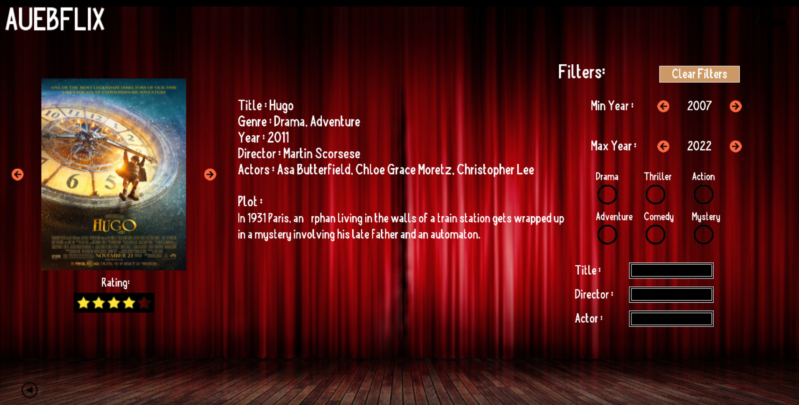

# Film-Browser C++ Application

This application uses the Simple Game Graphics (SGG) library to provide a visually pleasing experience for movie fans. 
It offers various type of buttons and widgets to ensure that the user can navigate easily and upgrade his experience.
The application disposes many filters, allowing users to search for a movie subset based on their interests.
It's also provided the option to search a spesific movie, by typing the title, the director or the actors.

## Features

- Users can navigate through a various range of movies with the help of next-previous buttons.

- A variety of different information is provided, such as the title, release year, genre, director, actors, a brief description and a couple of images for each movie.

- Easily find movie subsets based on different criteria.
  - Genre Filter: Users can discover movies based on their preferred genre.
  - Max-Min Year Filter: Users can find movies released in a specific year or within a range of years.
  - Text Search: Users can type titles, directors or actors to search for a specific movie or movies with a specific actor.

## How to Run

1. **Download the Application:**

   - Clone the project.

2. **Find the 'bin' Folder:**

   - Open the folder with the application files.
   - Inside this folder, find the subfolder named 'bin'.

3. **Run the Film Browser:**

   - Locate the `AUEBFLIX` executable file.
   - Double-click on the `AUEBFLIX` executable.
