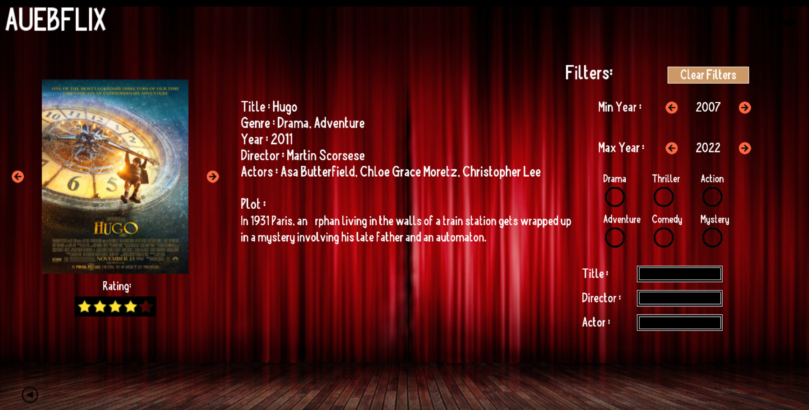

# Film-Browser C++ Application

This application uses the Simple Game Graphics (SGG) library to provide a visually pleasing experience for movie fans. 
It offers various type of buttons and widgets to ensure that the user can navigate easily and upgrade his experience.
The application disposes many filters, allowing users to search for a movie subset based on their interests.
It's also provided the option to search a spesific movie, by typing the title, the director or the actors.

## Features
- **User-friendly Navigation:**
  - Next-previous buttons allow seamless browsing through a large movie collection.

- **Detailed Movie Information:**
  - Title, release year, genre, director, actors, description, and images for each movie.

- **Advanced Search and Filtering:**
  - **Genre Filter:** Search for movies based on preferred genres.
  - **Year Range Filter:** Find movies released within a specific time frame.
  - **Text Search:** Locate movies using **titles, director names, or actor names**.

---

## How to Run
### 1. Download and Set Up
- **Clone the repository** to your local system.
- Ensure all dependencies, including the **SGG library**, are installed.

### 2. Locate the 'bin' Folder
- Navigate to the project directory.
- Find the **'bin'** folder, which contains the compiled executable.

### 3. Run the Film Browser
- Locate the **AUEBFLIX** executable file.
- **Double-click** on `AUEBFLIX.exe` to launch the application.

---

## System Requirements
- **Operating System:** Windows/Linux
- **Compiler:** g++ with C++11 or later
- **Graphics Library:** Simple Game Graphics (SGG)

---

## Contributors
- **Developer:** Maria Schoinaki